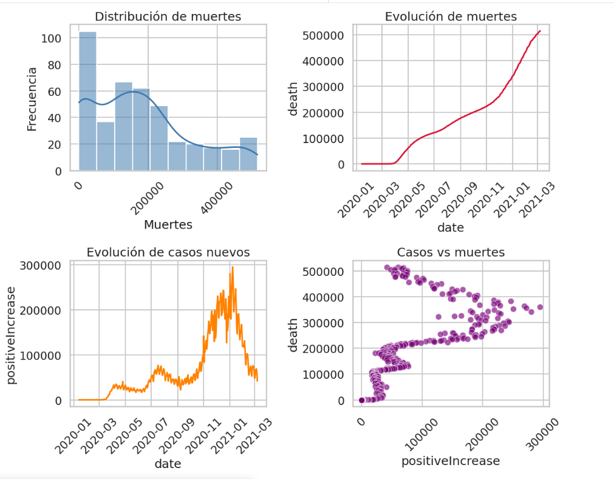

# Análisis Exploratorio de Datos — COVID-19 en EE.UU.

> Proyecto de EDA realizado sobre datos históricos de la pandemia de COVID-19 en Estados Unidos, con el objetivo de presentar conclusiones limpias y accionables al equipo directivo.

---

## 📋 Descripción

Este proyecto realiza un **Análisis Exploratorio de Datos (EDA)** completo sobre el dataset histórico del [COVID Tracking Project](https://covidtracking.com/data/download), que registró datos diarios sobre la pandemia en Estados Unidos desde 2020 hasta marzo de 2021.

El objetivo es transformar datos crudos en información significativa: limpiar, explorar, procesar, visualizar y extraer conclusiones que cuenten la historia de cómo evolucionó la pandemia en EE.UU.

---

## 📁 Estructura del Repositorio

```
📦 ia_project_eda_grupo1
 ┣ 📓 EDA-exploration-data-analyst.ipynb        # Notebook principal con el análisis completo
 ┣ 📄 .gitignore
 ┗ 📄 README.md
```
---

## 🗂️ Dataset

- **Fuente:** [The COVID Tracking Project](https://covidtracking.com/data/download)
- **Archivo:** `national-history.csv`
- **Cobertura:** Datos nacionales diarios de EE.UU. — enero 2020 a marzo 2021
- **Registros:** ~400 filas / 40+ columnas

### Columnas principales utilizadas

| Columna | Descripción |
|---|---|
| `date` | Fecha del registro |
| `states` | Número de estados que reportaron ese día |
| `positive` | Casos positivos acumulados |
| `positiveIncrease` | Nuevos casos diarios |
| `death` | Muertes acumuladas |
| `deathIncrease` | Nuevas muertes diarias |
| `hospitalizedCurrently` | Hospitalizados activos |
| `inIcuCurrently` | Pacientes en UCI activos |
| `onVentilatorCurrently` | Pacientes en ventilador activos |
| `totalTestResults` | Total de pruebas realizadas |
| `totalTestResultsIncrease` | Nuevas pruebas diarias |

---

## 🔍 Análisis Realizado

### 1. Carga y exploración inicial
- Inspección de tipos de dato con `dtypes` e `info()`
- El dataset contiene **420 registros** y **17 columnas**
- Identificación de columnas numéricas cargadas erróneamente como `float64`
- La columna `states` se identificó como categórica discreta (número de estados que reportaron ese día, no un estado geográfico)

### 2. Limpieza y preprocesado
- Conversión de `date` de `object` a `datetime64[ns]`
- Normalización forzada de columnas numéricas a `Int64` mediante bucle con `pd.to_numeric(errors='coerce')`
- Tratamiento de valores nulos con `fillna(0)` — se asume que ausencia de dato equivale a cero casos ese día
- Verificación de duplicados: **0 filas duplicadas** y **0 fechas repetidas**

### 3. Estadística descriptiva
- `describe()` para resumen estadístico general
- Análisis de asimetría (`skew`) y curtosis (`kurt`) por variable:
  - `positiveIncrease`: skew positivo → cola larga hacia valores altos
  - `negativeIncrease`: skew negativo → cola hacia la izquierda
  - `deathIncrease`: curtosis alta (leptocúrtica) → días con picos extremos
  - `hospitalizedCurrently`: curtosis negativa (platicúrtica) → distribución plana

### 4. Detección de outliers
- Visualización con boxplots individuales y panel 2×2 (Seaborn)
- Método IQR para `positiveIncrease`: **40 días atípicos**, pico máximo el **08-01-2021** con 295.121 casos
- Método IQR para `deathIncrease`: **28 días atípicos**, pico máximo el **12-02-2021** con 5.427 muertes

### 5. Visualizaciones
- Histogramas con KDE para distribución de variables clave
- Gráficos de línea para evolución temporal de muertes y contagios
- Scatter plots: `positiveIncrease` vs `death`
- Violin plot de `inIcuCurrently`
- Heatmap de correlaciones (Pearson) entre métricas clave
- Creación de columna `month` para agrupación temporal mensual



### 6. Análisis de correlaciones
- **Pearson r = 0.715** entre `positiveIncrease` y `deathIncrease` (p-valor ≈ 0, estadísticamente muy significativo)
- **Spearman ρ = 0.716** — confirma relación monótona sólida
- Correlación casi perfecta (0.99) entre `hospitalizedCurrently` e `inIcuCurrently`
- Correlación (0.97) entre `inIcuCurrently` y `onVentilatorCurrently`

### 7. Tasas epidemiológicas
- **Tasa de letalidad global: 1,79%** (515.151 muertes / 28.756.489 casos)
- **Tasa de supervivencia global: 98,21%**
- Evolución temporal de la tasa de supervivencia: caída inicial en 2020, recuperación y estabilización por encima del 98% hacia 2021

---


## 🛠️ Tecnologías Utilizadas

<p align="center">


</p>


| Librería | Uso |
|---|---|
| `requests` | Consumo de API y descarga de datos |
| `pandas` | Manipulación y análisis de datos |
| `matplotlib` | Gráficos estáticos base |
| `seaborn` | Visualizaciones estadísticas |
| `bokeh` | Gráficos interactivos |
| `scipy.stats` | Correlaciones estadísticas (Pearson, Spearman) |

---

## 🚀 Cómo ejecutar

1. Clona el repositorio:
```bash
git clone https://github.com/tu-usuario/eda-covid19.git
cd ai_project_eda_grupo_1.git
```

2. Instala las dependencias:
```bash
pip install pandas matplotlib seaborn bokeh scipy requests
```

3. Descarga el dataset:
```bash
# Descarga manual desde
# https://covidtracking.com/data/download/national-history.csv
```

4. Abre el notebook en Google Colab:
```bash
- Ve a Google Colab
- Selecciona Archivo → Abrir notebook → GitHub
- Busca el repositorio y abre EDA-exploration-data-analyst.ipynb
- Sube el archivo national-history.csv al entorno de Colab
- Ejecuta las celdas en orden

```

---

## 📊 Principales Hallazgos

- Los **nuevos casos diarios** presentan distribución fuertemente asimétrica a la derecha, con picos en enero 2021 coincidiendo con las fiestas navideñas.
- Las **muertes diarias** siguen a los casos con un desfase aproximado de **14 días**, confirmado con análisis de correlación con lag.
- Existe una **correlación muy alta** entre `hospitalizedCurrently` e `inIcuCurrently` (~0.9+), ya que UCI es subconjunto de hospitalizados.
- Se detectaron **28 días atípicos** en `deathIncrease`, con el pico máximo el 12 de febrero de 2021 (5.427 muertes en un día).
- La **tasa de positividad** (`positiveIncrease / totalTestResultsIncrease`) permite medir la presión sobre el sistema de salud de forma más precisa que los casos absolutos.

---

## 👥 Equipo

> Ana Paula Montiel,
> Noelia Sánchez,
> Romina Navea 

---

## 📄 Licencia

Los datos utilizados están bajo licencia [CC BY 4.0](https://covidtracking.com/license) del COVID Tracking Project / The Atlantic.
